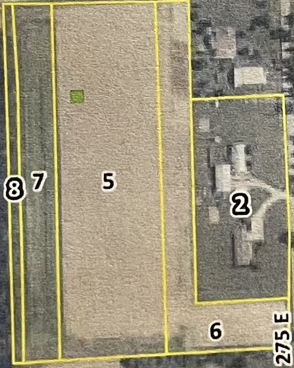
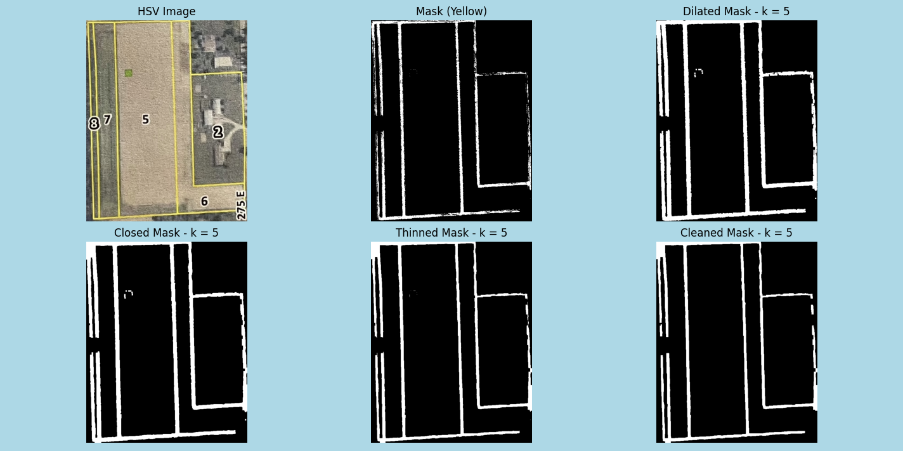

# Automated Conversion of FSA Document to Shapefiles
This is an implementation of an automated approach to converting FSA files of farmland tracts into geo-referenced ShapeFiles using Python.

## This repository includes:
1) 'main.py' - the python file containing code that performs the cropped image to shapefile conversion
2) 2 Example output shapefiles.
3) 3 input image examples used to test the project.
4) A folder called Figures, contianing plots generated by matplotlib, that illustrates the effect of different kernel sizes on the resulting output.

### Section 1: main.py
main.py was written with the help of GTP 3.5 and follows this outline:
- Import necessary packages
- Convert the image from BGR format to HSV, making the image's distinct colors easier to recognize by the computer.
- Provides the computer with a definition of yellow found in the image. This definition contains a lower and upper boundary to encompass the various shades of yellow.

- Masks the image by turning off all pixels that fall outside the lower and upper yellow HSV color values.
- Dilates (enlarges) the yellow pixels kept on by the mask using a kernel size of '25' and OpenCV's function 'cv2.dilate'. 25 was chosen because it helped merge small gaps (and corners), enabling the next step to act more effectively.
- Closes the gaps between the yellow pixels using a kernel size of '100' and OpenCV's 'cv2.morphologyEx' with the necessary second parameter 'cv2.MORPH_CLOSE'. 100 was chosen because it will close large gaps.
- Erodes the previously enlarged, kept on by the mask, region (thins the lines back out) using a kernel size of '25' and OpenCV's 'cv2.erode' function. The lines needed to be thinned to maintain accurate proportions when mapped using the affine transform (later in the process).
- Cleans up noise in the eroded image using a kernel size of '5' and OpenCV's 'cv2.morphologyEX' function with the necessary second parameter of 'cv2.MORPH_OPEN'. Not much cleaning was needed because the image was cropped to exclude as much unneeded yellow as possible.

- Plots the changes made by the previous process in a single figure using matplotlib.

- Using OpenCV's 'cv2.findContours' function, the program then searches for the outer boundary of the yellow region kept by the mask.
- The contour point array is then flattened for ease of acces later in the program.
- 3 GPS Coordinates (in this case NW, SW, and SE) are chosen to be used in the generation of an affine transform. The NE coordinate was ignored because it did not represent the actual NE corner of the image and was not needed.
- Pixel indices of the same 3 corners of the actual image are found (NW, SW, and SE). This is determined by a search for each corner.
- Defines the source and destination points that will be used in the affine transformation.
- Generates the Affine Transform, used next in the mapping of image pixels to geospatial coordinates.
- Each point in the contour list is then mapped using the previously generated affine transformation, resulting in a list of 'shapely.Polygon' points that can be represented in '.shp' format.
- A 'gpd.GeoDateFrame' is then created and its geometry is set to the list of polygon points.
- A coordinate reference system is then applied (in this case a common default is applied: EPSG:4326).
- The resulting output is saved using a defined filepath and in shapefile format.

### Section 2: The Output Shapefiles
The first 'wholeparcel_shapefile.shp' contains the resulting shapefile if the user were to place the correct input without making any edits. The second 'defaultkernels_shapefile.shp' contains the resulting shapefile should the kernel size of all 4 morphological processes, performed on the input found in 'main.py', be set to the default value of 5.

### Section 3: The Input Images
- The original image, as sent to me, is the 'FSA_Plot.heic' file. I manually converted it to a .jpeg using an online converter. This resulted in 'FSA_Plot.jpg'.

- After a few tries with 'main.py', I learned that the surrounding white portions of the paper document were being included in the yellow HSV color range and kept in the mask. While this could potentially be cleaned in the morphological processes, I thought it simpler to simply remove the opportunity for error here. Therefore, I cropped the image to include just the yellow bounded region, tightening the cropped boundary as much as I could. A tighter crop DOES NOT increase the success of the process, plenty of green space can be kept as long as the color values do not closely resemble yellow.

### Section 4: Figures
The figures folder contains a couple exported figures from matplotlib, containing the results of the conversion process with different parameter sets. The names of each file briefly explain what they represent, but I will provide more detail here:
- 'boundary_5x5kernel_all.png' contains the process if all kernels were set to the default value of 5.

- 'boundary_25-100-25-5-kernels.png' contains the process if each kernel were adjusted to 25, 100, 25, 5 in that order of the process. This combination, I found, produced a quality output because it enlarged the mask a bit, then closed large gaps (hence the large kernel size), then eroded it an equal amount to its enlargement, and then cleaned up little specks that may have been present in the surrounding regions of the image.

## Future Directions and Further Uses:
- If you wanted to keep certain regions and exclude others, you could manually make edits to the input image, drawing yellow around the desired regions and covering with black the yellow boundaries you don't want to keep. 
What that will do though is redefine the corners of the image, requiring some edits to the code. Logic would need to be added that maps the edited image to recalculated gps coordinates according to the new yellow boundaries. This would also require that the input is cropped so that 3 corners of the image are as close as possible to 3 provided GPS coordinates in the real-world. These will need to be accurate when recalculating the edited gps coordinates and corner pixels locations.
